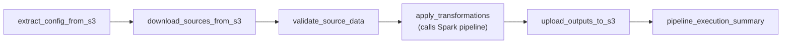

# Dynamic Spark Pipeline (Config-Driven) + Airflow DAG

This repository implements a **config-driven PySpark ETL pipeline** that can be run:

- Locally from the CLI (Python + venv)
- Inside an Airflow DAG (see [dags/dynamic_spark_pipeline_dag.py](dags/dynamic_spark_pipeline_dag.py))

The pipeline is defined entirely by JSON configs in [metadata/](metadata/): **sources → transformations → sinks**.

## Project structure

- [src/main.py](src/main.py): CLI entrypoint; loads config (local or `s3://...`) and runs the engine
- [src/engine.py](src/engine.py): Orchestrates sources → transformations → sinks
- [src/reader.py](src/reader.py): Reads sources (`spark.read.format(...).load(path)`)
- [src/transformers.py](src/transformers.py): Transformation registry + handlers (config-driven)
- [src/validations.py](src/validations.py) + [src/validator.py](src/validator.py): Data quality validation framework
- [src/writer.py](src/writer.py): Writes sinks with optional output versioning
- [metadata/](metadata/): Example configs (recommended starting point)
- [dags/](dags/): Airflow DAG to orchestrate the pipeline and optionally sync outputs to S3

## Run locally (venv)

### Prerequisites

- Linux/macOS
- Python 3.9+ (this repo’s Docker image uses Python 3.9)
- Java 17 (required by PySpark)

### Create venv + install dependencies

```bash
python -m venv .venv
source .venv/bin/activate

python -m pip install --upgrade pip
pip install pyspark boto3 botocore
```

### Run an example config

```bash
python src/main.py --config metadata/config_clients.json --app-name "MyPipeline"
```

Other examples:

```bash
python src/main.py --config metadata/config_customer.json --app-name "CustomerDQ"
python src/main.py --config metadata/config_s3_test.json --app-name "S3Test"
```

### Notes

- Config placeholders `${VAR_NAME}` are supported and resolved from environment variables (see `ConfigResolver` in [src/main.py](src/main.py)).
- Output versioning is disabled by default (see [src/writer.py](src/writer.py)).
	- Enable with: `export OUTPUT_VERSIONING=true` (or set `"versioning": true` per sink)
	- When enabled, outputs are written under `_versions/<run_id>/` and a `_latest` pointer (or `LATEST` marker) is updated.

## Config file structure (professional reference)

Config examples live in:

- [metadata/config_clients.json](metadata/config_clients.json)
- [metadata/config_customer.json](metadata/config_customer.json)
- [metadata/config_s3_test.json](metadata/config_s3_test.json)

### Top-level schema

| Key | Type | Required | Description |
|---|---:|:---:|---|
| `dataflows` | `array[dataflow]` | ✅ | List of one or more dataflows. Current engine runs the **first** dataflow (`dataflows[0]`). |
| `metadata` | `object` | ❌ | Optional documentation block (version, notes, environment, etc.). Ignored by the engine. |

### `dataflow` schema

| Key | Type | Required | Description |
|---|---:|:---:|---|
| `name` | `string` | ❌ | Friendly name for the dataflow. |
| `description` | `string` | ❌ | Human-readable description. |
| `sources` | `array[source]` | ✅ | Input datasets to load into Spark. Each source is registered by `name`. |
| `transformations` | `array[transformation]` | ❌ | Ordered transformation steps. Each step produces a named dataframe. |
| `sinks` | `array[sink]` | ✅ | Where to write results (JSON, Parquet, ...). |

### `source` schema

| Key | Type | Required | Description |
|---|---:|:---:|---|
| `name` | `string` | ✅ | Source dataframe name (used as `params.input` for transformations). |
| `format` | `string` | ✅ | Spark format (e.g., `JSON`, `CSV`, `PARQUET`). |
| `path` | `string` | ✅ | Local path or `s3a://...` path. |
| `options` | `object` | ❌ | Passed to Spark reader via `.options(**options)`. |
| `description` | `string` | ❌ | Documentation only. |

### `sink` schema

| Key | Type | Required | Description |
|---|---:|:---:|---|
| `name` | `string` | ❌ | Sink name for logs/debugging. |
| `input` | `string` | ✅ | Name of dataframe to write (must exist). |
| `format` | `string` | ✅ | Spark format (e.g., `JSON`, `PARQUET`). |
| `saveMode` | `string` | ✅ | Spark save mode (e.g., `OVERWRITE`, `APPEND`). |
| `paths` | `array[string]` | ✅ | One or more output paths. |
| `options` | `object` | ❌ | Passed to Spark writer via `.options(**options)`. |
| `partitionBy` | `array[string]` | ❌ | Partition columns for output. |
| `versioning` | `bool \| object` | ❌ | Enable/disable output versioning per sink (default: enabled). |
| `description` | `string` | ❌ | Documentation only. |

## Transformations (what you can use in config)

Transformations are implemented as handlers in [src/transformers.py](src/transformers.py). The engine executes them in order.

### Common transformation fields

| Key | Type | Required | Description |
|---|---:|:---:|---|
| `name` | `string` | ✅ (except `validate_fields` output handling) | Name of the produced dataframe (used by later steps and sinks). |
| `type` | `string` | ✅ | Transformation type. |
| `params` | `object` | ✅ | Transformation parameters (must include `input`). |
| `params.input` | `string` | ✅ | Name of the input dataframe. |

### Supported transformation types

| `type` | Extra params (besides `input`) | Output |
|---|---|---|
| `validate_fields` | `validations: array[validation_rule]` | Produces two dataframes: `validation_ok` and `validation_ko` |
| `add_fields` | `addFields: array[{name,function}]` | Dataframe with new columns |
| `filter_rows` | `condition: string` | Filtered dataframe |
| `derive_column` | `column: string`, `expression: string` | Dataframe with derived column |
| `select_columns` | `columns: array[string]` | Dataframe with only selected columns |
| `rename_columns` | `mappings: object` | Dataframe with renamed columns |
| `drop_columns` | `columns: array[string]` | Dataframe with dropped columns |

### `add_fields` function support

Currently implemented:

- `current_timestamp`

## Validations (data quality)

Validations are configured under `validate_fields` and implemented in:

- [src/validations.py](src/validations.py): registry of validators + condition builders
- [src/validator.py](src/validator.py): `DataQualityValidator` that splits valid vs invalid records

### Validation rule schema

| Key | Type | Required | Description |
|---|---:|:---:|---|
| `field` | `string` | ✅ | Column name to validate. Must exist in the dataframe. |
| `validations` | `array[string \| object]` | ✅ | List of validators. Each entry can be a simple string or a dict with parameters. |
| `message` | `string` | ❌ | Default message for the field (overridden by validator-level `message`). |

Validator entry forms:

- Simple: `"notNull"`
- Parameterized: `{ "type": "between", "min": 0, "max": 150, "message": "Age must be 0-150" }`

### Available validator types

Simple (no parameters):

- `notNull`, `notEmpty`, `numeric`, `integer`, `positive`, `nonNegative`, `email`, `phone`, `dateFormat`, `datetimeFormat`, `uuid`, `url`

Parameterized:

- `minLength`, `maxLength`, `lengthBetween`, `between`, `greaterThan`, `lessThan`, `equals`, `pattern`, `inList`, `startsWith`, `endsWith`, `contains`

Advanced:

- `custom_sql` with `{ "type": "custom_sql", "expression": "{column} IS NOT NULL AND {column} <> ''" }`

## Airflow DAG flow (diagram + explanation)

The Airflow DAG is defined in [dags/dynamic_spark_pipeline_dag.py](dags/dynamic_spark_pipeline_dag.py).

### DAG task flow



### What each task does

1. **extract_config_from_s3**
	- Picks a config file (default is controlled by Airflow Variables).
	- For local/dev, it reads configs from `metadata/`.
	- Resolves source paths to absolute paths (keeps sink paths relative for S3 key construction).
2. **download_sources_from_s3**
	- Currently verifies local source files exist (acts as a placeholder for real S3 downloads).
3. **validate_source_data**
	- Performs basic file existence/size checks and stores results in XCom.
4. **apply_transformations**
	- Prepares a Spark-friendly config (converts sink paths to absolute local paths).
	- Calls the pipeline CLI entrypoint from [src/main.py](src/main.py), which runs:
	  - [src/reader.py](src/reader.py) to load sources
	  - [src/engine.py](src/engine.py) to apply transformation handlers
	  - [src/writer.py](src/writer.py) to write outputs
5. **upload_outputs_to_s3**
	- If `enable_s3_sync=true`, uploads output files to S3 using Airflow AWS connection or env credentials.
	- If disabled, it only verifies outputs exist locally.
6. **pipeline_execution_summary**
	- Logs a human-readable summary of the run.

